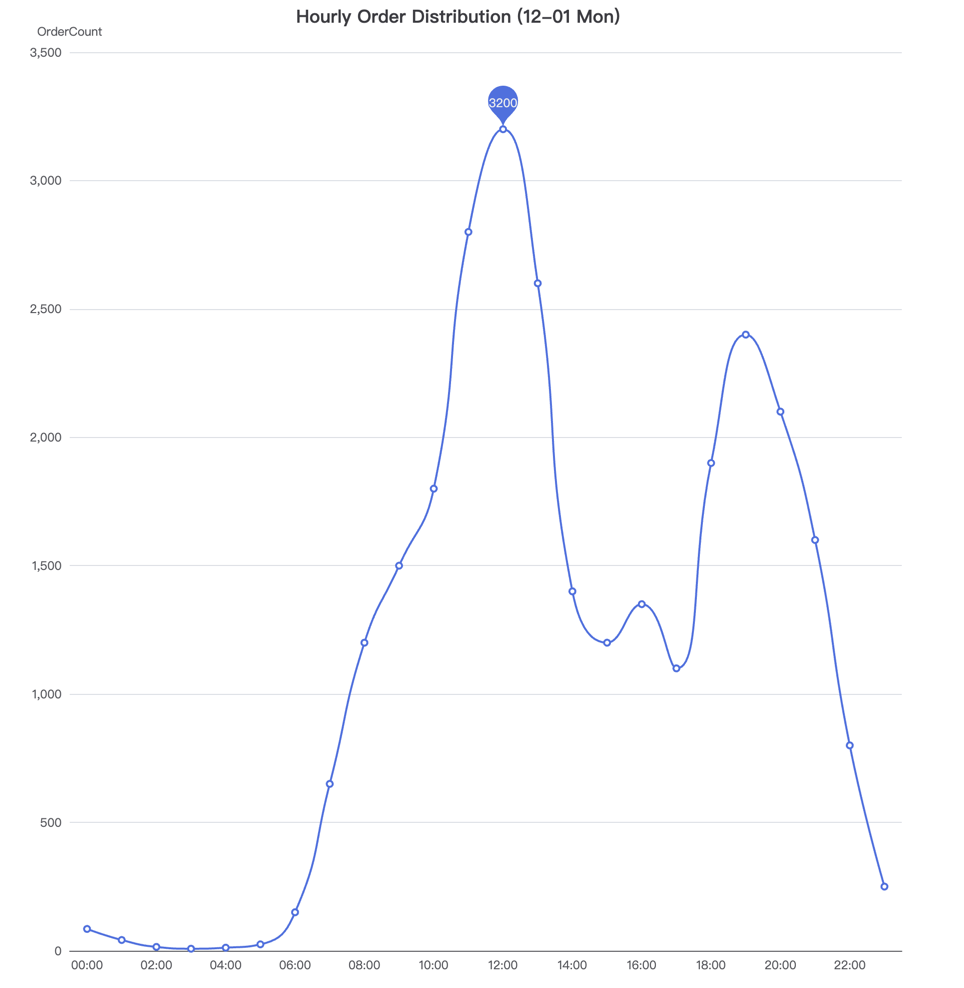
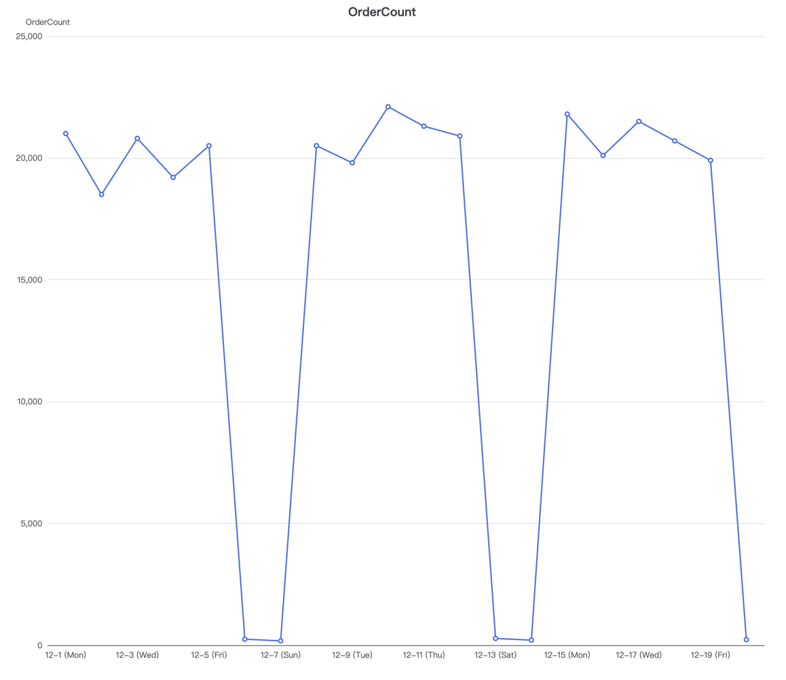

## 背景

我负责的业务是电商数据集成平台，对接了数十个电商平台（Shopify、Amazon、WooCommerce 等）和 SaaS 工具（ERP、物流系统等），将订单、库存、商品等数据在各系统之间双向同步。

这套系统的核心挑战在于：上游平台各不相同，数据量和稳定性差异极大，而下游业务对数据时效性要求很高。这就要求监控体系既能覆盖基础的技术健康度，又能感知业务层面的异常。

### 技术指标

技术层面主要关注三个维度：

- **延迟**：延迟过高会直接影响业务数据的时效性。以库存同步为例，如果上游平台的 API 响应从 200ms 劣化到 10s，库存更新的延迟会从秒级退化到分钟级，严重时可能导致超卖——用户下单时看到有货，实际库存早已为零。
- **错误率**：包括网络层面的连接失败（DNS 解析超时、TLS 握手失败）以及云基础设施故障（Cloudflare 5xx、AWS 区域性故障等）。这类错误通常是短暂的，但如果持续出现，说明底层出了问题。
- **业务错误码**：上游平台返回了 HTTP 200，但 body 里带着业务错误码（比如 `RATE_LIMIT_EXCEEDED`、`INVALID_TOKEN`）。这类"成功的失败"更隐蔽，纯靠 HTTP 状态码监控无法捕获。

每个上游平台的稳定性差异极大。大型平台的稳定性相对好一些，比如 Amazon、Shopify，而 WooCommerce 这类自建站则参差不齐：

- 有的平台 API 可用性 99.99%，有的隔三差五抽风
- 有的延迟稳定在 100ms，有的在高峰期飙到 10s
- 有的严格遵循 RESTful 规范返回标准错误码，有的返回一个 200 OK 加一段 HTML 错误页面

当你只对接 3-5 个平台时，为每个平台手动设阈值还能接受。但当平台数量膨胀到几十个，传统的静态阈值监控就变成了一场噩梦——你不是在做监控，你是在做阈值的维护工作。

### 业务指标

业务指标相对技术指标来说更复杂，因为它天然带有**周期性**（这里先讨论周级别的周期性，黑五等大促的流量模式更复杂，暂不展开）。

以订单量为例，一天内的流量分布是不均匀的：


*（注：图中数据为脱敏后生成的 Mock 数据，仅用于展示分布趋势，不代表真实业务量级）*

上图是某个周一的小时级订单量分布。可以看到两个明显的峰值：午间 12 点左右达到约 3300 单的日内最高点，晚间 20 点左右出现约 2400 单的第二峰。凌晨 0 点到早晨 7 点之间几乎没有订单。如果在凌晨 3 点用白天的阈值去判断"订单量是否异常偏低"，必然会误报。

拉长到周级别，周期性更加明显：


*（注：图中数据为脱敏后生成的 Mock 数据，仅用于展示分布趋势，不代表真实业务量级）*

上图展示了连续三周的日级订单趋势。工作日的订单量稳定在 20000 单/天左右，而每到周末（周六、周日）订单量会断崖式下降到接近 0。这个模式非常稳定——如果某个工作日的订单量突然跌到 5000 以下，那几乎可以确定出了问题；但如果是周六跌到 0，则完全正常。

这意味着：**一套好的业务监控，必须理解数据本身的周期性，否则要么漏报（周末真出了问题但以为是正常低谷），要么误报（工作日正常波动被当成异常）。**


# 从静态阈值到动态基线

## 静态阈值

最基本的做法是为每个平台设置固定的告警规则：

```yaml
# 简单粗暴的告警规则
- alert: HighErrorRate
  expr: rate(api_requests_total{status=~"5.."}[5m]) / rate(api_requests_total[5m]) > 0.05
  for: 5m
  labels:
    severity: critical
```

这在只有少数几个平台的时候能工作，但问题很快就暴露了：

1. **阈值难以统一**：平台 A 的正常错误率是 0.1%，平台 B 由于 API 设计的原因，正常错误率在 2% 左右（比如频繁返回 429 限流）。一个统一的 5% 阈值对 A 太宽松，对 B 又太敏感。
2. **时间模式各异**：有的平台在北美工作时间延迟升高是正常的，有的平台每周四凌晨会有维护窗口。静态阈值无法理解这些周期性波动。
3. **告警疲劳**：当你有 40 个平台 × 3 种指标（错误率、延迟、吞吐量），维护 120+ 条告警规则是不现实的。最终的结果是大家开始忽略告警——真正的故障来临时，反而淹没在一堆噪音中。

**我的实践**：静态阈值不要废弃，而是把它作为**兜底措施**。阈值设得足够宽松，满足绝大部分平台的正常波动范围。比如错误率阈值设为 20%——正常情况下没有平台会触达，一旦触发，说明出了严重问题，必须立即响应。这一层是防线，不是主力。

## 动态基线：让系统自己学习"正常"

核心思路是：**不要告诉系统什么是"异常"，而是让系统自己学习什么是"正常"，偏离正常的才是异常。**

### 基于统计的方法

这里先讨论统计学的检测方法。业界也有使用机器学习模型（如 Prophet、Isolation Forest）来做异常检测的方案，但后者要求的配套基础设施更复杂（特征工程、模型训练、模型服务），对于大多数团队来说 ROI 不高，暂不讨论。

最实用的方法是利用 Prometheus 的 `avg_over_time`、`stddev_over_time` 等函数，为每个平台自动计算动态基线：

```promql
# 计算过去 7 天同一时段的平均错误率作为基线
avg_over_time(
  platform_error_rate{platform="shopify"}[7d:1h]
)
```

这里用 7 天的窗口而不是更短，是因为 7 天刚好覆盖一个完整的周周期，可以自然地将"周三下午的表现"与"过去几个周三下午的表现"对比，而不是与"昨天凌晨的表现"对比。

然后用 Z-Score 的思路来判断当前值是否异常：

```
z = (当前值 - 历史均值) / 历史标准差
```

当 |z| > 3 时（当前值偏离均值超过 3 个标准差），在正态分布的假设下，这个事件发生的概率不到 0.3%，我们有较高的信心认为这是一个真正的异常，而不是正常波动。

用 PromQL 表达：

```promql
# 动态异常检测：当前错误率偏离基线超过 3 个标准差
(
  rate(api_errors_total{platform="shopify"}[5m])
  - avg_over_time(rate(api_errors_total{platform="shopify"}[5m])[7d:1h])
)
/ stddev_over_time(rate(api_errors_total{platform="shopify"}[5m])[7d:1h])
> 3
```

这个方法的好处是**全自动适配**：平台 A 的正常错误率是 0.1% 且波动很小（标准差 0.05%），那它偏离到 0.25% 就会触发告警；平台 B 的正常错误率在 1%-3% 之间波动（标准差约 0.8%），那它要到 5%+ 才会报警。每个平台有了属于自己的"正常范围"，无需人工逐一配置。

**注意事项**：Z-Score 假设数据近似正态分布，对于偏态严重的指标（比如错误率在大部分时间是 0，偶尔突然跳高），直接用 Z-Score 可能效果不理想。这种场景下可以考虑对数据做对数变换，或者改用分位数方法。

### 延迟监控的分位数方法

错误率用 Z-Score 效果不错，但延迟监控需要更细腻的处理。延迟分布通常是长尾的（大部分请求很快，少数请求很慢），均值和标准差不能很好地描述这种分布的特征。我更倾向于用分位数：

```promql
# P99 延迟偏离历史 P99 基线的程度
histogram_quantile(0.99, rate(api_request_duration_seconds_bucket[5m]))
/ avg_over_time(
    histogram_quantile(0.99, rate(api_request_duration_seconds_bucket[5m]))[7d:1h]
  )
> 3
```

当 P99 延迟是历史基线的 3 倍以上时触发告警。这比硬编码 "延迟 > 2s" 灵活得多——对于一个正常 P99 就在 5s 的慢平台，2s 的阈值毫无意义；而对于一个正常 P99 在 50ms 的快平台，2s 的阈值又太宽松，等触发的时候问题已经很严重了。

实践中我通常同时监控 P50 和 P99：
- **P50 飙升**：说明整体性能劣化，大部分请求都变慢了，往往指向系统性问题（如上游平台负载过高、网络链路异常）
- **P99 飙升但 P50 正常**：说明只有少数请求变慢，可能是个别商户的数据量异常大、触发了限流、或者命中了上游的某个慢路径

## 告警降噪：从指标到可执行的通知

真实环境中的大规模数据集成，大部分新配置的监控都会伴随着噪声。很多小平台或小卖家本身就不稳定，频繁触发告警，如果每一条都要 RD 投入人力去排查，会非常消耗精力，尤其是夜间值班。

我的实践是**告警与人力匹配原则**——不同级别的告警，对应不同的响应策略：

| 告警级别 | 触发条件                     | 响应策略 |
|---------|--------------------------|---------|
| P0 致命 | 静态兜底阈值触发（如错误率 > 20%）     | 立即电话通知值班人员，5 分钟内响应 |
| P1 严重 | 动态基线偏离超过 3σ 且持续 10 分钟以上 或核心大卖家业务指标异常 | IM 群告警，30 分钟内响应 |
| P2 警告 | 动态基线偏离超过 2σ，或小卖家业务指标异常   | IM 群告警，工作时间处理，不叫夜间值班 |

对于业务指标，关键的一步是**对用户进行分级**。大卖家（月 GMV 超过一定阈值）的告警走 P0/P1 通道，优先服务；小卖家的告警降级为 P2/P3，等到工作时间排期处理。这个分级策略让夜间值班的告警量降低了大约 70%，同时没有漏掉任何一次大卖家的真实故障。

## 业务指标监控：从 Prometheus 到 ClickHouse

前面讨论的动态基线方案基于 Prometheus，适合平台维度的技术指标（错误率、延迟、吞吐量）。但业务指标的监控有一个本质区别：**粒度是店铺级别的**。

我们需要回答的问题不是"Shopify 整体的订单量是否异常"，而是"店铺 A 今天的订单量相比它自身的历史基线是否异常"。平台上有成千上万个店铺，每个店铺的订单量级、活跃时段、品类特征都不同——一个日均 5000 单的大卖家和一个日均 10 单的小卖家，它们的"正常"完全是两个世界。

这种高基数（high cardinality）、店铺级别的聚合分析，Prometheus 是很难胜任的。Prometheus 的设计初衷是时序指标的实时查询和告警，当 label 的基数膨胀到数万级别（每个店铺一个 label value），存储和查询性能都会急剧劣化。

### 基于 ClickHouse 日志底表 + 视图的方案

我们的做法是将业务指标的监控链路建在 ClickHouse 上。核心架构是：**日志底表（Map 类型存储灵活字段）→ 物化视图（预聚合）→ 卖家特征表（JOIN 补充用户画像）**。

日志底表使用 ClickHouse 的 `Map(String, String)` 类型存储业务事件的扩展字段。这样做的好处是，不同平台、不同业务类型的事件可以共用一张表，新增字段不需要 DDL 变更：  
注: 以下表名称和字段均为 Mock 数据，只讨论思路
```sql
CREATE TABLE integration_event_log
(
    event_time  DateTime,
    shop_id     UInt64,
    platform    LowCardinality(String),
    event_type  LowCardinality(String),  -- order_sync, inventory_sync, ...
    status      LowCardinality(String),  -- success, failed, partial
    properties  Map(String, String)       -- 灵活扩展字段：order_count, error_code, ...
)
ENGINE = MergeTree()
PARTITION BY toYYYYMMDD(event_time)
ORDER BY (platform, shop_id, event_time);
```

在此基础上创建物化视图，将原始日志按小时、按店铺预聚合：

```sql
CREATE MATERIALIZED VIEW shop_hourly_stats_mv
TO shop_hourly_stats
AS
SELECT
    toStartOfHour(event_time)                             AS hour,
    shop_id,
    platform,
    count()                                               AS event_count,
    countIf(status = 'success')                           AS success_count,
    countIf(status = 'failed')                            AS fail_count,
    sumIf(CAST(properties['order_count'] AS UInt64), properties['order_count'] != '')
                                                          AS order_count
FROM integration_event_log
GROUP BY hour, shop_id, platform;
```

### JOIN 卖家特征表实现分级告警

有了店铺级别的聚合数据后，还需要知道"这个店铺有多重要"才能决定告警优先级。这就需要 JOIN 卖家的特征表：

```sql
-- 卖家特征表：记录卖家的分级、GMV 量级等特征
CREATE TABLE seller_profile
(
    shop_id       UInt64,
    seller_tier   LowCardinality(String),  -- platinum, gold, silver, bronze
    monthly_gmv   Decimal(18, 2),
    primary_category LowCardinality(String),
    updated_at    DateTime
)
ENGINE = ReplacingMergeTree(updated_at)
ORDER BY shop_id;
```

告警查询时，将店铺的实时指标与特征表 JOIN，就可以同时回答"有没有异常"和"这个异常有多重要"：

```sql
-- 查找最近 1 小时订单量偏离历史基线超过 3σ 的店铺，并按卖家等级排序
SELECT
    s.shop_id,
    s.platform,
    p.seller_tier,
    p.monthly_gmv,
    s.order_count                                        AS current_count,
    hist.avg_count                                       AS baseline_avg,
    hist.stddev_count                                    AS baseline_stddev,
    (s.order_count - hist.avg_count) / hist.stddev_count AS z_score
FROM shop_hourly_stats AS s
JOIN seller_profile AS p ON s.shop_id = p.shop_id
JOIN (
    -- 过去 4 周同一星期几、同一小时的历史基线
    SELECT
        shop_id,
        avg(order_count)    AS avg_count,
        stddev(order_count) AS stddev_count
    FROM shop_hourly_stats
    WHERE hour >= now() - INTERVAL 28 DAY
      AND toDayOfWeek(hour) = toDayOfWeek(now())
      AND toHour(hour) = toHour(now())
    GROUP BY shop_id
    HAVING stddev_count > 0
) AS hist ON s.shop_id = hist.shop_id
WHERE s.hour = toStartOfHour(now())
  AND abs((s.order_count - hist.avg_count) / hist.stddev_count) > 3
ORDER BY p.seller_tier ASC, abs(z_score) DESC;
```

这条查询的关键点在于：历史基线用的是**过去 4 周同一星期几、同一小时**的数据，天然考虑了前文提到的日内和周级别的周期性。一个周一下午 3 点的订单量，只会跟过去 4 个周一下午 3 点比较，而不是跟周末或凌晨比较。

查询结果按 `seller_tier` 排序，platinum 卖家的异常排在最前面，触发 P0/P1 告警；bronze 卖家的异常排在后面，走 P2/P3 通道。这样就把"是否异常"和"多重要"两个问题在一条查询里解决了。


# 告警上下文与高频运维手册

光有告警通知还不够，值班人员收到告警后的第一反应是"我该怎么处理"。如果告警只有一行 `HighErrorRate firing`，值班的人还得自己去查是哪个平台、影响了哪些商户、当前是什么量级的问题。这种信息缺失会显著拖慢响应速度。

## 告警消息的上下文设计

在告警消息中附带足够的上下文，让值班的人能快速判断严重程度和处理方式：

- **标题反映优先级和影响范围**：比如 `[P0] Shopify 错误率 35% ` 比 `HighErrorRate` 有用得多
- **关键数据内联展示**：当前值、基线值、偏离倍数、持续时间
- **附带运维手册的直达链接**：不要让值班的人自己去搜索文档

## 运维手册的实践

大部分服务在上线时都会编写运维手册，但当服务多了之后，重大事故的告警响铃时，依靠人工去翻几十份技术手册大海捞针，并不是一种高效的办法。

我们的做法是：

1. **告警与手册绑定**：每条告警规则在定义时就关联对应的运维手册链接，告警触发后自动带上。值班的人打开告警详情就能一键跳转到处理步骤。
2. **高频手册置顶**：在告警的 IM 聊天群中，将致命告警对应的高频处理手册（Top 5-10 的常见故障场景）置顶。紧急事故中不用翻历史消息，抬头就能看到。
3. **手册保鲜机制**：每次复盘后更新对应手册，标注上次更新时间。超过 3 个月未更新的手册标记为"待验证"，避免值班人员按照过时的步骤操作。


---

*参考资料：*
- [Smart Alerting: Dynamic Thresholds - Rendiment](https://rendiment.io/monitoring/prometheus/2024/09/10/smart-alerting-dynamic-thresholds.html)
- [AI Anomaly Detection: Complete Guide for DevOps & SRE 2026](https://openobserve.ai/blog/ai-anomaly-detection-guide/)
- [Prometheus Alertmanager Noise-Reduction - Netdata](https://www.netdata.cloud/academy/prometheus-alert-manager/)
- [Prometheus Alerting Best Practices](https://prometheus.io/docs/practices/alerting/)
- [What if you never had to tweak your alerting thresholds?](https://medium.com/doubleverify-engineering/what-if-you-never-had-to-tweak-your-alerting-thresholds-for-your-metrics-14a08da8d3d4)
